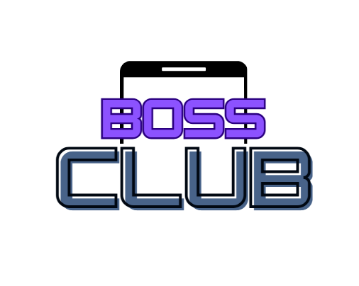

# BossClub App


<p align="center">
  
</p>

<p align="center">
  
</p>

<p align="center">
  
</p>

> **🏅 Second Runners Up**  
> This project earned the Second Runners Up position at **IntraHacktive 1.0**, a prestigious hackathon at BRAC University!

---

### Overview
Welcome to our project! We’re Team Watermelon, a dedicated team of developers and innovators from BRAC University. This project represents our hard work, creativity, and collaboration, and we’re excited to share it with you. Check out the rest of the README to learn more about our work and how you can contribute!


## Table of Contents

1. [Description](#description)
2. [Features](#features)
3. [Getting Started](#getting-started)
   - [Prerequisites](#prerequisites)
   - [Installation](#installation)
4. [Technical Stack and Architecture](#technical-stack-and-architecture)
5. [User Guide](#user-guide)
6. [Challenges and Solutions](#challenges-and-solutions)
7. [Future Enhancements](#future-enhancements)
8. [Contributing](#contributing)

## Description

BossClub is a mobile application designed for streamlined management of club activities and events. Built with a user-friendly interface, it simplifies communication, event planning, budgeting, and more. The app serves both regular club members and leaders, providing tools and access specific to their roles, making it an essential tool for any organization or group.

## Features

- **Forum**: A discussion board for club members to post, comment, and like posts.
- **Event Request Portal**: Members can request new events, which are then reviewed by admins.
- **Event Approval Section**: Displays events approved by club leaders.
- **Club Budget Management**: Allows club leaders to add, edit, and track the club’s budget.
- **Leaders' Contacts**: Easily accessible contact information for club leadership.
- **Announcement Panel**: A section dedicated to important club announcements.
- **Volunteering Forms**: Forms for members to sign up for various volunteer opportunities.
- **User Roles**: Different permissions for members, leaders, and admins.
- **Event Calendar**: Shows upcoming events, allowing users to view details and RSVP.
- **Work Assignment**: Leaders can assign tasks and track member contributions.

## Getting Started

### Prerequisites

- **Android Studio**: Download and install [Android Studio](https://developer.android.com/studio).
- **Java/Kotlin ktx**: Ensure you have the Java/Kotlin ktx set up in Android Studio.
- **Knowledge of Android Development**: Basic knowledge of Java and XML is helpful for customization.

### Installation

1. Clone the repository:

   ```bash
   git clone https://github.com/yourusername/BossClub.git
   ```

2. Open the project in Android Studio.
3. Sync the project with Gradle and run on an emulator or device.

Alternate method

1. Open Android Studio: Launch Android Studio. On the Welcome screen, choose "Get from VCS". If you’re already in a project, go to File > New > Project from Version Control.

2. Enter Repository URL:

3. In the "URL" field, paste the repository link:

   ```bash
   git clone https://github.com/yourusername/BossClub.git
   ```

4. Select a directory where you want to clone the project locally.
5. Clone the Repository: Click Clone. Android Studio will download the project files and set up the workspace automatically.


### Open the project

Launch Android Studio.
Click File > Open, navigate to the cloned directory, and open the project.

### Sync with Gradle:

Once the project is open, Android Studio should prompt you to sync with Gradle files.
Click on Sync Now and wait for the dependencies to load.

### Run the app:

Connect an Android device or open an emulator.
Click on Run > Run 'app' or the play button to start the app on the device.

## Technical Stack and Architecture

The BossClub app is built using a combination of modern technologies to ensure high performance and scalability:

- **Frontend**: The app's user interface is developed with Java/Kotlin ktx in Android Studio, using XML for layout design. The app follows the Model-View-Controller (MVC) pattern, with Activities and Fragments managing each core feature.
- **Backend**: Firebase is used for real-time data management, authentication, and storage, allowing seamless updates and secure access control.
- **Database**: Firebase Firestore manages dynamic data storage, including user roles, events, announcements, forum posts, and budgeting records.
- **Libraries**:Firebase Authentication for secure login and user verification.
  Firebase Firestore for database management.
  RecyclerView and CardView for creating dynamic and interactive layouts.
  Glide for efficient image loading and caching.

## User Guide

- **Sign Up and Log In**: New users create an account with Firebase Authentication, while returning users can log in directly.
- **Dashboard**: Upon login, the user lands on the Dashboard, displaying key announcements, recent forum posts, and upcoming events.
- **Navigation**: The app’s bottom navigation bar includes:
- **Forum**: View posts, comment, and interact with other members.
- **Calendar**: Displays events. Users can click each event for details and RSVP.
- **Events**: Submit event requests (members) or approve pending events (admins).
- **Budget**: Leaders manage the club budget, add new expenses, or edit existing records.
- **User Roles**: Admins and Leaders have extra options like task assignment, event approval, and access to budgeting tools.
- **Log Out**: Users can log out via the settings, returning to the login screen.

## Challenges and Solutions

- **Real-Time Data Synchronization**: Ensuring data consistency across devices posed challenges. Solution: Used Firebase’s real-time capabilities to update data immediately and employed local caching to handle offline scenarios.
- **Role-Based Access Control**: Implementing permissions for different user roles was complex. Solution: Defined specific roles in Firestore and structured the app’s code to display features based on user roles, ensuring secure and organized data access.
- **UI Responsiveness**: Ensuring smooth UI transitions across different screen sizes and orientations required careful testing. Solution: Utilized ConstraintLayout for flexible layouts and tested on multiple devices for consistent user experience.

## Future Enhancements

- **Push Notifications**: Adding notifications for upcoming events and announcements to keep members engaged.
- **In-App Messaging**: Direct messaging feature for members to connect in real-time.
- **Advanced Analytics**: Providing club leaders with insights on event attendance, engagement metrics, and budget utilization.
- **External Calendar Sync**: Allow users to sync club events with their personal calendars for better scheduling integration.
- **Feedback System**: Implement a system for gathering member feedback on events and the app itself to guide future improvements.
- **Loading Animation**: More animations to be incorporated for better visualization.

## Contributing

### 🍉 Team Watermelon

<div align="center">

| Contributor        | GitHub Profile                                                                                 | Followers                                                                                           |
|--------------------|------------------------------------------------------------------------------------------------|-----------------------------------------------------------------------------------------------------|
| **Ahmed Awsaf**    | [](https://github.com/AhmedAwsaf) |           |
| **Zaima Mashiat**  | [](https://github.com/zaimamashiat) |        |
| **Abrar Jahin Alvee** | [](https://github.com/abraralvee) |           |

</div>

---

Thank you for visiting our project! 🌟 We welcome contributions and suggestions from the community.  
Feel free to follow us, connect, and check out our work!


